<div align="center">



<br/>


</div>

<br/>

## 👨‍💻 About Me

```python
class GeraldoAugusta:
    def __init__(self):
        self.role = "Informatics Engineering Student"
        self.focus = ["Data Science", "Machine Learning", "Data Analysis"]
        self.location = "Indonesia 🇮🇩"
        self.currently_learning = ["Advanced Data Analysis", "Machine Learning"]
        self.motto = "Turning Data Into Insights and Ideas Into Reality"

    def say_hi(self):
        print("Thanks for visiting my profile! 🚀")

me = GeraldoAugusta()
me.say_hi()
```

- 🎓 Informatics Engineering Student
- 📊 Interested in Data Science, Data Analysis, and Machine Learning
- 🌱 Currently deepening my skills in Advanced Data Analysis & ML
- 🤝 Open to collaborating on Data Science / ML projects
- 📍 Based in Indonesia

<br/>

## 🛠️ Tech Stack

<div align="center">

**Languages & Web**


**Data Science & Analytics**


**Tools & Platforms**


</div>

<br/>

## 📊 GitHub Analytics

<div align="center">


</div>

<div align="center">

</div>

<div align="center">

</div>

<br/>

## 🚀 Featured Projects

<div align="center">

| Project | Description |
|---|---|
| 📈 **Data Analysis Dashboard** | Interactive dashboard for analyzing business and sales performance |
| 🤖 **Machine Learning Project** | Predictive model development using Python and Scikit-Learn |
| 🎨 **Data Visualization Project** | Transforming raw datasets into meaningful visual insights |
| 🌐 **Web Development Project** | Responsive and user-friendly web application development |

</div>

<br/>

## 📫 Connect With Me

<div align="center">

<a href="https://github.com/GeraldoAugusta">
  
</a>
<a href="https://linkedin.com/in/geraldoaugusta">
  
</a>
<a href="mailto:geraldonyoman14@gmail.com">
  
</a>

</div>

<br/>

<div align="center">

### ✨ "Turning Data Into Insights and Ideas Into Reality" ✨


</div>
